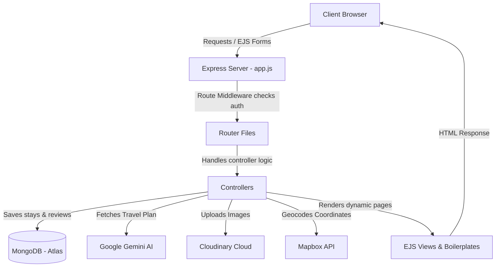

# 🚀 IntelliJorney AI - Project Overview & Ultimate Interview Preparation Guide

Yeh document aapko **IntelliJorney AI** (Wanderlust) project ke har ek functional, structural aur architectural detail ko aasan language mein samajhne aur viva/interview mein top karne ke liye design kiya gaya hai.

---

## 🏛️ 1. Project Architecture (Start to End)

IntelliJorney AI ek **Full-Stack Server-Side Rendered (SSR)** web application hai. 

* **Frontend:** EJS (Embedded JavaScript) Templates + Tailwind CSS / Bootstrap + EJS-Mate layouts.
* **Backend:** Node.js + Express.js.
* **Database:** MongoDB (using Mongoose ODM).
* **AI Engine:** Google Gemini AI API (`@google/generative-ai` SDK).
* **Cloud & Maps Integration:** Cloudinary (for image uploads) & Mapbox SDK (for maps).



---

## 🛠️ 2. Core Tech Stack Summary

| Technology | Role inside Project | Why we used it? |
| :--- | :--- | :--- |
| **Node.js** | Runtime Environment | Back-end JavaScript ko local computer/server par run karne ke liye. |
| **Express.js** | Web Framework | Easy routing, server configuration aur HTTP middleware handling ke liye. |
| **MongoDB Atlas** | Database | Scalable, document-based NoSQL database jisme properties flexible BSON (JSON-like) objects mein save hoti hain. |
| **Mongoose** | MongoDB ODM | Node.js mein MongoDB ke data models ko structure karne aur schema validation lagane ke liye. |
| **EJS (Embedded JS)** | Templating Engine | Server-Side Rendering (SSR) ke liye. HTML ke andar dynamic backend values/loops ko inject karne ke liye. |
| **Google Gemini API** | AI Integration | Users ko unke budget aur interest ke anusaar smart daily itinerary, local food, aur packing suggestions generate karke dene ke liye. |
| **Cloudinary** | Cloud Storage | Properties ki multiple HD images ko compress aur safely store karne ke liye. |
| **Mapbox SDK** | Location Mapping | Address/City ko automatically latitude & longitude mein badal kar dynamic maps par marker dikhane ke liye. |

---

## 🛡️ 3. Section-Wise Interview Questions & Answers

### 🤖 Section A: The Smart AI Travel Planner (Gemini AI)

> [!IMPORTANT]
> **Interviewer Focus:** AI integrations aajkal sabse zyada highlight hone wale points hain. In answers ko dhyan se padhein.

#### Q1. Apne project mein AI kaise integrate kiya hai? Kaun sa model use kiya hai?
* **Ans:** Humne Google ki `@google/generative-ai` SDK ka use kiya hai. Hum backend controller (`controllers/ai.js`) se user ke preferences (destination, source, transport, budget, interests) ko dynamically prompt mein structure karke API ko send karte hain.
* Humne **Primary Model** ke roop mein **`gemini-2.5-flash`** ka use kiya hai kyunki ye bohot fast hai aur travel planning ke concise aur accurate results deta hai.

#### Q2. `controllers/ai.js` mein backup models ka loop (Array) kyun banaya hai?
* **Ans:** Code snippet: `const modelsToTry = ["gemini-2.5-flash-lite", "gemini-2.5-flash", "gemini-flash-latest"];`
* Humne ek **Fallback ya Failover Mechanism** banaya hai. Agar Google ka primary model high traffic ya API limits ki wajah se temporary down ho jaye, toh humara loop automatic array mein se next available backup model par switch karke request bhej deta hai. Isse users ko bina kisi crash ke reliable response milta hai.

#### Q3. AI dwara diye gaye Markdown format ko HTML mein kaise badla?
* **Ans:** Gemini API response **Markdown (`.md`) format** mein detail itinerary deta hai. Browser markdown ko standard render nahi kar sakta. Isliye humne **`markdown-it`** library ka use kiya hai jo markdown strings ko standard **HTML content** mein parse kar deti hai, jise hum `<%- plan %>` tag ke zariye EJS mein inject kar dete hain.

---

### 🗄️ Section B: Database Design & Mongoose

#### Q4. Mongoose Schema mein `geometry` (coordinates) field kis liye hai?
* **Ans:** Yeh **GeoJSON format** follow karti hai. Mapbox map par properties ko display karne ke liye unka accurate location format `[longitude, latitude]` real numbers ke roop mein is geometry schema mein save kiya jata hai.

#### Q5. Cascading Deletion (Listing delete hone par reviews delete hona) kaise handle kiya?
* **Ans:** Humne `models/listing.js` mein **Mongoose Query Middleware / Post Hook** ka use kiya hai:
  ```javascript
  listingSchema.post("findOneAndDelete", async (listing) => {
    if(listing) {
       await Review.deleteMany({_id : {$in: listing.reviews}});
    }
  });
  ```
  Jab bhi koi listing database se delete ki jaati hai, tab `post-findOneAndDelete` automatic trigger hota hai aur us listing ke andar save reviews ki array me se saare review documents database se remove kar deta hai. Isse database storage waste nahi hota.

#### Q6. Mongoose mein `populate()` function ka kya role hai?
* **Ans:** MongoDB mein dynamic relationships reference IDs ke roop mein hote hain (jaise Listing ke andar `owner` aur `reviews` ki ObjectIds). **`populate()`** use karne par, Mongoose automatic dusre collections se poore documents ko fetch karke inject kar deta hai (bilkul SQL Database ke **JOIN** ki tarah).

---

### 🔐 Section C: Authentication, Middlewares & Sessions

#### Q7. `app.js` mein session ke andar `httpOnly: true` setting ka kya fayda hai?
* **Ans:** Yeh ek **XSS (Cross-Site Scripting) Security Protection** hai. Jab `httpOnly: true` set hota hai, toh browser ki client-side JavaScript cookies ko read nahi kar sakti. Isse koi hacker browser extension ke zariye user ke logged-in sessions ko hijack nahi kar sakta.

#### Q8. Custom Middleware `isLoggedIn` aur `saveRedirectUrl` ka implementation detail kya hai?
* **Ans:** 
  * `isLoggedIn` check karta hai ki user logged-in hai ya nahi. Agar nahi, toh wo unhe login page par redirect karta hai. Lekin redirect karne se pehle, wo user ke current URL path ko `req.session.redirectUrl` mein store kar deta hai.
  * User ke successful login hone par, `saveRedirectUrl` usi session memory se redirect path nikal kar local response memory (`res.locals.redirectUrl`) mein transfer kar deta hai taaki login ke baad user seedha us page par pahunche jahan wo jana chahta tha.

#### Q9. Passport.js aur Local Hashing kaise handle hoti hai?
* **Ans:** Humne secure registration aur session handling ke liye `passport` aur `passport-local` use kiya hai. passwords ko plaintext mein DB mein rakhna legal aur secure nahi hai. Humne **`passport-local-mongoose`** plugin ka use kiya hai jo automatically password ka safe **Salt and Hash** generate karke secure hashing algorithms (PBKDF2) ke sath DB mein save karta hai.

---

### 🌐 Section D: Environment & General Features

#### Q10. Multer aur Cloudinary image upload flow kya hai?
* **Ans:** 
  1. Frontend form `enctype="multipart/form-data"` ke zariye images bhejta hai.
  2. Server par **Multer** payload parse karta hai aur file streams ko read karta hai.
  3. **`multer-storage-cloudinary`** config engine in images ko direct Cloudinary servers par upload kar deta hai.
  4. Cloudinary upload successful hone par public image `url` aur unique `filename` return karta hai, jo hum database mein Listing schema ke under array mein store kar lete hain.

#### Q11. `method-override` aur `connect-flash` ka use case kya hai?
* **Ans:** 
  * **`method-override`:** HTML forms by default sirf `GET` aur `POST` verbs support karte hain. Agar server ko restful standards ke anusaar `PUT` (update) ya `DELETE` request bhejni ho, toh ye library query param `_method=PUT` ko intercept karke request method override kar deti hai.
  * **`connect-flash`:** Ek aisi flash message store service hai jo session memory ka temporary use karti hai taaki database update hone ke baad user ko success/error message display kiya ja sake aur page refresh hone par automatic remove ho sake.

---

## 🏗️ 4. Concept Clarity: SPA vs. SSR / MERN vs. IntelliJorney

### Q12. Kya aapka project ek standard "MERN Stack" project hai?
* **Ans:** Humara project full javascript architecture par run karta hai, isliye isse full stack bola jata hai. Lekin **React** (Single Page App) frontend use karne ke bajaye, humne **EJS (Server-Side Rendering)** templating use kiya hai backend logic ke sath tight integration rakhne ke liye. Isliye iska stack **MEN-EJS** hai (MongoDB, Express, Node, EJS).

### Q13. SPA (Single Page Application) aur SSR (Server-Side Rendering) mein kya antar hai?
* **Ans:**
  * **SPA (Single Page Application - e.g. React):** Browser sirf ek single black canvas HTML download karta hai. Uske baad javascript data fetch karti hai aur virtual DOM ke zariye screen refresh karti hai. Pages refresh nahi hote. (Fast user interaction but poor SEO initial load).
  * **SSR (Server-Side Rendering - e.g. EJS):** Server pehle se hi pure HTML template ko dynamic database values ke sath compile kar leta hai aur client browser ko direct ready-made page bhejta hai. Har click par naya page load hota hai aur reload hota hai. (Excellent for SEO and initial fast load time).

---

> [!TIP]
> **Pro-Tip for Viva/Interview:** Interviewer jab bhi aapse kisi feature ke baare mein pooche, toh flow zaroor samjhayye (jaise: User clicked -> route intercepted -> middleware passed validation -> controller requested Gemini API -> response converted by markdown-it -> EJS rendered HTML back to user!). Isse lagta hai ki code aapne khud banaya hai.
