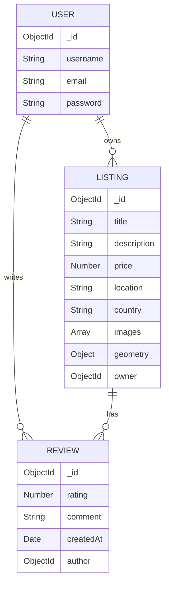

# IntelliJourney AI - Project Report Documentation

## 1. Problem Statement
Traditional travel planning is highly fragmented. Users often have to switch between multiple platforms: one for booking accommodations, another for mapping and navigation, and several others to research and build an itinerary. This manual process is time-consuming, overwhelming, and often results in suboptimal travel plans. Furthermore, existing accommodation platforms (like Airbnb) do not offer personalized, end-to-end trip planning driven by Artificial Intelligence. There is a need for a centralized platform that not only allows users to find and review accommodations but also provides an intelligent, AI-powered travel planner to generate custom itineraries based on the user's budget, timeline, and preferences.

## 2. Objectives
- **Integrated Platform:** To develop a full-stack web application that combines property listings, user reviews, and travel planning in one place.
- **AI-Powered Planning:** To integrate Google Gemini AI to generate customized, day-by-day travel itineraries based on destination, duration, and user interests.
- **User Engagement:** To allow users to create, read, update, and delete (CRUD) their own property listings and leave ratings/reviews.
- **Interactive Mapping:** To implement Mapbox for accurate geocoding and interactive maps, helping users visualize property locations.
- **Responsive Design:** To ensure a seamless, mobile-friendly user interface with an intuitive and visually appealing design.

## 3. Literature Review
The online travel market is dominated by platforms like Airbnb, Booking.com, and MakeMyTrip. 
- **Airbnb / Booking.com:** Provide robust peer-to-peer property listing but lack native AI trip planning capabilities. Users must use third-party tools to figure out what to do once they arrive.
- **TripAdvisor:** Excellent for reviews and discovering activities, but its itinerary building requires heavy manual effort from the user.
- **ChatGPT / AI Chatbots:** Great for generating text-based itineraries, but they are isolated from the actual booking and location-viewing ecosystem.

**IntelliJourney AI** bridges this gap by offering a cohesive ecosystem where AI itinerary generation, property discovery, and interactive mapping coexist, saving time and improving the travel planning experience.

## 4. Feasibility Study
- **Technical Feasibility:** The project utilizes established technologies (Node.js, Express, MongoDB, EJS) making it highly feasible. APIs like Mapbox (for geolocation), Cloudinary (for image storage), and Google Gemini (for AI) offer robust SDKs and comprehensive documentation.
- **Economic Feasibility:** The project uses open-source technologies and the free tiers of third-party services (MongoDB Atlas, Cloudinary, Mapbox, Gemini API), making the initial development and deployment cost essentially zero.
- **Operational Feasibility:** The intuitive UI ensures that users with basic web navigation skills can easily list properties or generate AI itineraries without requiring technical training.

## 5. System Architecture
IntelliJourney AI follows the MVC (Model-View-Controller) architecture:
- **Client (Frontend):** EJS templates rendered on the server with CSS/Bootstrap for styling. It sends HTTP requests (GET, POST, PUT, DELETE) to the server.
- **Server (Backend):** Node.js and Express.js handle routing, middleware processing (authentication via Passport.js), and business logic.
- **Database:** MongoDB (via Mongoose) stores collections for Users, Listings, and Reviews.
- **External APIs:** 
  - *Cloudinary* (Image storage)
  - *Mapbox* (Forward geocoding & Map rendering)
  - *Google Gemini AI* (Prompt processing and itinerary generation)

## 6. ER Diagram
*The Entity-Relationship model consists of three main entities:*

- **User:** `_id`, `username`, `email`, `password` (hashed).
- **Listing:** `_id`, `title`, `description`, `images` (array of url/filename), `price`, `location`, `country`, `geometry` (coordinates), `owner` (ref: User), `reviews` (Array of ref: Review).
- **Review:** `_id`, `comment`, `rating`, `createdAt`, `author` (ref: User).

**Relationships:**
- A **User** can create many **Listings** (1:N).
- A **User** can write many **Reviews** (1:N).
- A **Listing** can have many **Reviews** (1:N).



## 7. Use Case Diagram
*Key Actors: Guest (Unregistered), Registered User, System*

```mermaid
usecaseDiagram
    actor "Guest" as G
    actor "Registered User" as U
    
    G --> (View Listings)
    G --> (View Reviews)
    G --> (Register / Login)
    
    U --> (View Listings)
    U --> (Add New Listing)
    U --> (Edit/Delete Own Listing)
    U --> (Add/Delete Own Review)
    U --> (Use AI Travel Planner)
    U --> (Logout)
```

## 8. Data Flow Diagram
**Level 0 (Context Level):**
User <---> [ IntelliJourney AI System ] <---> External APIs (Mapbox, Gemini, Cloudinary)
[ IntelliJourney AI System ] <---> MongoDB Database

**Level 1 (Process Level):**
1. **Authentication:** User provides credentials -> System verifies with DB -> Returns Session Cookie.
2. **Listing Management:** User submits form with image -> System uploads to Cloudinary -> Geocodes via Mapbox -> Saves to DB -> Returns rendered page.
3. **AI Planning:** User submits prompt -> System sends payload to Gemini API -> Receives Markdown response -> Parses to HTML using `markdown-it` -> Renders to User.

## 9. Methodology
The project follows an **Agile / Iterative Development** methodology:
- **Phase 1 (Foundation):** Setup Express server, basic routing, EJS templating, and basic Listing CRUD operations.
- **Phase 2 (Database & UI):** Connect MongoDB, refine schemas, and implement the frontend design (Bootstrap/CSS).
- **Phase 3 (Authentication & Security):** Implement Passport.js for User signup/login, route protection, and server-side validation using Joi.
- **Phase 4 (Integrations):** Integrate Mapbox for maps, Cloudinary for image hosting, and Google Gemini API for the AI planner.
- **Phase 5 (Refinement):** Add multiple image upload support, optimize mobile UI, dark mode styling, and error handling optimization.

## 10. Modules Description
1. **User Authentication Module:** Handles secure registration, login, and session management using `passport-local-mongoose`. Ensures route protection.
2. **Listing Module:** The core module allowing users to browse, create, edit, and delete properties. Integrates with Mapbox for location plotting and Cloudinary for multi-image uploads.
3. **Review Module:** Allows users to rate properties (1-5 stars) and leave comments. Provides feedback to property owners and future guests.
4. **AI Travel Planner Module:** The standout feature. Takes user inputs (destination, budget, days, activities) and interacts with the Google Gemini API to generate structured, formatted itineraries.
5. **Error Handling Module:** Custom ExpressError class and middleware to catch async errors and provide user-friendly error pages and flash messages.

## 11. Output Screenshots
*(Note: For the actual report, you should insert screenshots below these headings)*
- **Figure 1:** Home Page / Listings Index (Showing Airbnb-style grid of properties)
- **Figure 2:** Listing Details Page (Showing property info, Mapbox map, and Reviews section)
- **Figure 3:** User Signup / Login Forms
- **Figure 4:** AI Travel Planner Input Form
- **Figure 5:** AI Travel Planner Generated Itinerary Result

## 12. Conclusion
IntelliJourney AI successfully demonstrates a modern, full-stack web application that solves real-world travel planning issues. By combining robust database management (MongoDB), dynamic server-side rendering (Express/EJS), and cutting-edge Generative AI (Google Gemini), the project provides a unified, efficient, and highly interactive user experience. It effectively showcases the implementation of MVC architecture, RESTful routing, secure authentication, and third-party API integration.

## 13. Future Scope in this project
- **Payment Gateway Integration:** Integrating Stripe or Razorpay to allow actual booking and payment processing for properties.
- **Real-time Chat:** Implementing WebSockets (Socket.io) to allow potential guests to chat with property owners directly.
- **Advanced AI Capabilities:** Upgrading the AI to suggest real-time flight data, live weather updates, and direct booking links based on the itinerary.
- **Mobile Application:** Developing a cross-platform mobile app using React Native for iOS and Android users.
- **Multi-language Support:** Adding i18n to make the platform accessible to a global audience.
